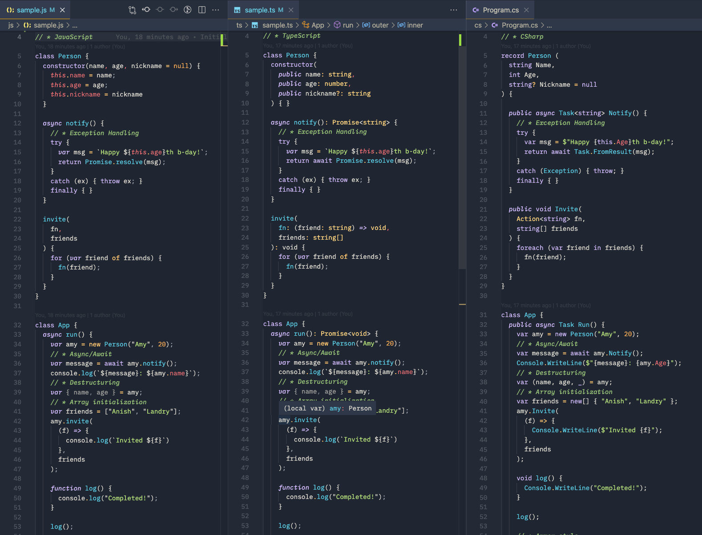

# Building up from JavaScript to TypeScript to C# 10 and .NET 6

This repository is meant to highlight some of the various functional techniques available in C#.

Read more here: https://chrlschn.medium.com/building-up-from-javascript-to-typescript-to-c-10-and-net-6-669a70cd0a66



These functional elements of C# ultimately mean that there is quite a bit of syntactic congruence with JavaScript and TypeScript; in fact, I first noticed that C# and JavaScript starting to converge around the release of .NET 3.0.

For many developers that are ready to extend from JavaScript and TypeScript on the backend to a more secure, performant, and robust backend runtime, C# on .NET is a natural extension as it has a clear lineage with JavaScript and TypeScript while providing many benefits including easy mutli-threading, language integrated query (LINQ), and many other features.

If you'd like to learn more about C#'s functional features, check out:

- [Lambda Expressions](https://docs.microsoft.com/en-us/dotnet/csharp/language-reference/operators/lambda-expressions)
- [Local Functions](https://docs.microsoft.com/en-us/dotnet/csharp/programming-guide/classes-and-structs/local-functions)
- [Pattern Matching](https://docs.microsoft.com/en-us/dotnet/csharp/fundamentals/functional/pattern-matching)
- [Discards](https://docs.microsoft.com/en-us/dotnet/csharp/fundamentals/functional/discards)
- [Desconstructing](https://docs.microsoft.com/en-us/dotnet/csharp/fundamentals/functional/deconstruct)
- [var and Implicit Typing](https://docs.microsoft.com/en-us/dotnet/csharp/language-reference/keywords/var)
- [Object Initializers](https://docs.microsoft.com/en-us/dotnet/csharp/programming-guide/classes-and-structs/how-to-initialize-objects-by-using-an-object-initializer)
- [Array Initializers](https://docs.microsoft.com/en-us/dotnet/csharp/programming-guide/arrays/single-dimensional-arrays)

## If You'd Like to Contribute...

Make a fork and send a PR!  I'd love to see folks add more examples.

(It may make sense to have sub-folders under `ts`, `js`, and `csharp`)

## Running the JavaScript Sample

Install Node: https://nodejs.org/en/download/

To run the JavaScript sample:

```
cd js
node sample.js
```

## Running the TypeScript Sample

Install TypeScript: https://www.typescriptlang.org/download

To run the TypeScript sample:

```
cd ts
tsc
node sample.js
```

## Running the C# Sample

Install the .NET SDK: https://dotnet.microsoft.com/en-us/download

To run the C# sample:

```
cd cs
dotnet run
```

To create your own .NET console project once you have the SDK installed:

```
dotnet new console
```
